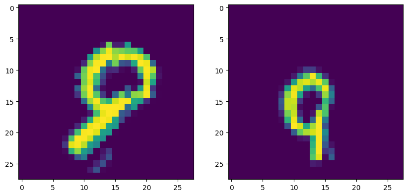

 

# Contrastive learning : SimCLR

Contrastive learning is a type of unsupervised learning where the objective is to learn representations of data that are useful for downstream tasks. It works by contrasting different views of the same data point in a latent space, encouraging similar representations for the same data point and different representations for different data points. This allows the model to learn useful features even without labeled data.

SIMCLR is a contrastive learning method that was introduced in 2020. It works by maximizing the similarity between augmented views of the same image and minimizing the similarity between augmented views of different images. SIMCLR uses a simple and efficient neural network architecture and has achieved state-of-the-art results on several benchmark datasets. It has been widely adopted in the deep learning community and is considered a promising approach for learning useful representations from unlabeled data.

The main idea of this repository is to suggest a way to use SIMCLR on the MNIST dataset in order to get a performing model with only 100 labeled data. To achieve this goal, we need to do a pretraining of our model with augmented data among the unlabeled data, then perform a training with our 100 labeled data

## Model

Our model is a junction between a encoder and a projection head.
The whole junction will be train of the augmented views of the unlabeled data with a contrastive loss function in order to learn a rich and useful representation of the input images, then we will throw away the projection head and keep the encoder trained to make downstream task, in our case, a classification work.

## Benchmark

When we do the pretraining of our model, we gain about 7% d'accuracy over the baseline model (in our case, a classic convolutional neural network)

|  | Accuracy top-1 |
| --- | --- |
| Baseline | 0.8462 ± 0.0042 |
| SIMCLR | 0.9194 ± 0.0030 |

## References

 - [A simple framework for contrastive learning of visual representations, T.Chen, S.Kornblith, M.Norouzi, G.Hinto](https://arxiv.org/abs/2002.05709)
 - [Github giakou4](https://github.com/giakou4)

## Contributors

 - [Tristan Margate](https://github.com/Tmargate)
 - [Ahmed Osman](https://github.com/AhmedOsman00py)
 - [Bourahima Coulibaly](https://github.com/CouLiBaLy-B)
